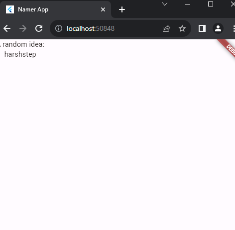
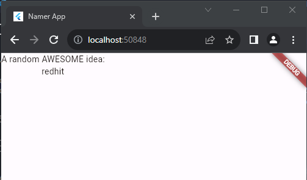
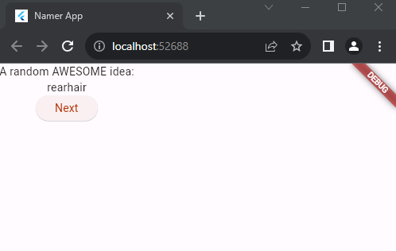
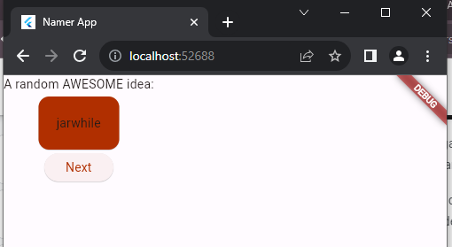
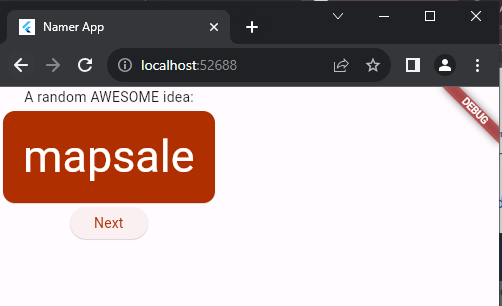
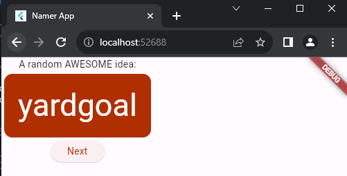
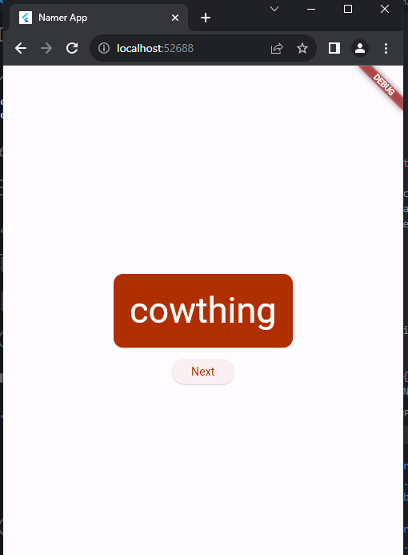

# Pemrograman Mobile Minggu 5

Nama : Sabilla Luthfi Rahmadhan

No Absen : 19

Kelas : TI-3G

---

## Praktikum 3 : Membuat proyek

Pada panel sebelah kiri VS Code, pastikan bahwa Penjelajah dipilih lalu buka file pubspec.yaml.

```
name: namer_app
description: A new Flutter project.

publish_to: 'none' # Remove this line if you wish to publish to pub.dev

version: 0.0.1+1

environment:
  sdk: '>=2.19.4 <4.0.0'

dependencies:
  flutter:
    sdk: flutter

  english_words: ^4.0.0
  provider: ^6.0.0

dev_dependencies:
  flutter_test:
    sdk: flutter

  flutter_lints: ^2.0.0

flutter:
  uses-material-design: true
```

Berikutnya, buka file konfigurasi lainnya dalam proyek tersebut, analysis_options.yaml.

```
include: package:flutter_lints/flutter.yaml

linter:
  rules:
    prefer_const_constructors: false
    prefer_final_fields: false
    use_key_in_widget_constructors: false
    prefer_const_literals_to_create_immutables: false
    prefer_const_constructors_in_immutables: false
    avoid_print: false
```

Terakhir, buka file main.dart pada direktori lib/.

```
import 'package:english_words/english_words.dart';
import 'package:flutter/material.dart';
import 'package:provider/provider.dart';

void main() {
  runApp(MyApp());
}

class MyApp extends StatelessWidget {
  const MyApp({super.key});

  @override
  Widget build(BuildContext context) {
    return ChangeNotifierProvider(
      create: (context) => MyAppState(),
      child: MaterialApp(
        title: 'Namer App',
        theme: ThemeData(
          useMaterial3: true,
          colorScheme: ColorScheme.fromSeed(seedColor: Colors.deepOrange),
        ),
        home: MyHomePage(),
      ),
    );
  }
}

class MyAppState extends ChangeNotifier {
  var current = WordPair.random();
}

class MyHomePage extends StatelessWidget {
  @override
  Widget build(BuildContext context) {
    var appState = context.watch<MyAppState>();

    return Scaffold(
      body: Column(
        children: [
          Text('A random idea:'),
          Text(appState.current.asLowerCase),
        ],
      ),
    );
  }
}
```

Output



---

## Praktikum 4 : Menambahkan Tombol

Pertama, buka lib/main.dart dan pastikan Anda memilih perangkat target. Di bagian pojok kanan bawah VS Code, Anda akan menemukan tombol yang menampilkan perangkat target saat ini. Klik tombol untuk mengubahnya.

### Hot Reload Pertama

Di bagian bawah lib/main.dart, tambahkan sesuatu pada string di objek Text pertama, dan simpan file tersebut (dengan Ctrl+S atau Cmd+S). Misalnya:

```
return Scaffold(
      body: Column(
        children: [
          Text('A random AWESOME idea:'),  // ← Example change.
          Text(appState.current.asLowerCase),
        ],
      ),
    );
```

Output :



Berikutnya, tambahkan tombol di bagian bawah Column, tepat di bawah instance Text kedua.

```
ElevatedButton(
            onPressed: () {
              print('button pressed!');
            },
            child: Text('Next'),
          ),
```

Output :



Scroll ke MyAppState lalu tambahkan metode getNext.

```
class MyAppState extends ChangeNotifier {
  var current = WordPair.random();

  // ↓ Add this.
  void getNext() {
    current = WordPair.random();
    notifyListeners();
  }
}
```

Tindakan terakhir adalah memanggil metode getNext dari callback tombol tersebut.

```
ElevatedButton(
      onPressed: () {
        appState.getNext();  // ← This instead of print().
      },
      child: Text('Next'),
    ),
```

Output :


---

## Praktikum 5 : Memperindah Tampilan Aplikasi

### Mengekstrak widget

Baris yang bertanggung jawab untuk menampilkan pasangan kata saat ini kini tampak seperti berikut: Text(appState.current.asLowerCase). Untuk mengubahnya menjadi sesuatu yang lebih kompleks, disarankan untuk mengekstrak baris ini ke widget terpisah. Memiliki beberapa widget untuk beberapa bagian logis dari UI Anda adalah cara penting dalam mengelola kompleksitas pada Flutter.

Flutter menyediakan pembantu pemfaktoran ulang untuk mengekstrak widget, tetapi sebelum Anda menggunakannya, pastikan bahwa baris yang akan diekstrak hanya mengakses yang diperlukan. Sekarang baris tersebut mengakses appState, tetapi sebenarnya baris tersebut hanya perlu mengetahui apa pasangan kata saat ini.

Oleh karena itu, tulis ulang widget MyHomePage sebagai berikut:

```
class MyHomePage extends StatelessWidget {
  @override
  Widget build(BuildContext context) {
    var appState = context.watch<MyAppState>();
    var pair = appState.current;                 // ← Add this.

    return Scaffold(
      body: Column(
        children: [
          Text('A random AWESOME idea:'),
          Text(pair.asLowerCase),                // ← Change to this.
          ElevatedButton(
            onPressed: () {
              appState.getNext();
            },
            child: Text('Next'),
          ),
        ],
      ),
    );
  }
}
```

Bagus. Widget Text tidak lagi merujuk kepada keseluruhan appState.

Sekarang, panggil menu Refactor. Pada VS Code, Klik kanan potongan kode yang ingin Anda faktorkan ulang (dalam hal ini Text) dan pilih Refactor... dari menu drop-down,

Tindakan ini secara otomatis membuat class baru, BigCard, di akhir file saat ini. Class tersebut akan terlihat seperti berikut:

```
class BigCard extends StatelessWidget {
  const BigCard({
    super.key,
    required this.pair,
  });

  final WordPair pair;

  @override
  Widget build(BuildContext context) {
    return Text(pair.asLowerCase);
  }
}
```

### Menambahkan Kartu

Sekarang saatnya membuat widget baru ini menjadi UI tebal yang kita bayangkan di awal bagian ini.

Temukan class BigCard dan metode build() yang berada di dalamnya. Sama seperti sebelumnya, panggil menu Refactor pada widget Text. Namun, kali ini Anda tidak akan mengekstrak widget.

Sebagai gantinya, pilih Wrap with Padding. Tindakan ini menciptakan widget induk baru di sekitar widget Text bernama Padding. Setelah menyimpannya, Anda akan melihat bahwa kata acak tersebut telah memiliki ruang yang lebih luas.

```
Widget build(BuildContext context) {
    return Padding(
      padding: const EdgeInsets.all(8.0),
      child: Text(pair.asLowerCase),
    );
  }
```

Berikutnya, mari kita naik satu tingkat lebih tinggi. Tempatkan kursor Anda pada widget Padding, buka menu Refactor, lalu pilih Wrap with widget....

Tindakan ini memungkinkan Anda untuk menentukan widget induk. Ketik "Card" dan tekan Enter.

```
@override
  Widget build(BuildContext context) {
    return Card(
      child: Padding(
        padding: const EdgeInsets.all(8.0),
        child: Text(pair.asLowerCase),
      ),
    );
  }
```

Output :


### Tema dan gaya

Untuk membuat kartu menjadi lebih menarik, beri warna yang lebih kaya pada kartu tersebut. Karena ada baiknya untuk menjaga skema warna yang konsisten, gunakan Theme aplikasi untuk memilih warna.

Buat perubahan berikut untuk metode build() BigCard.

```
@override
  Widget build(BuildContext context) {
    final theme = Theme.of(context);       // ← Add this.

    return Card(
      color: theme.colorScheme.primary,    // ← And also this.
      child: Padding(
        padding: const EdgeInsets.all(20),
        child: Text(pair.asLowerCase),
      ),
    );
  }
```

Output :



### TextTheme

Kartu tersebut masih memiliki masalah: ukuran teks terlalu kecil dan warnanya membuat teks sulit dibaca. Untuk memperbaiki masalah ini, buat perubahan berikut pada metode build() BigCard.

```
@override
  Widget build(BuildContext context) {
    final theme = Theme.of(context);
    // ↓ Add this.
    final style = theme.textTheme.displayMedium!.copyWith(
      color: theme.colorScheme.onPrimary,
    );

    return Card(
      color: theme.colorScheme.primary,
      child: Padding(
        padding: const EdgeInsets.all(20),
        // ↓ Change this line.
        child: Text(pair.asLowerCase, style: style),
      ),
    );
  }
```

Output :



### Meningkatkan aksesibilitas

Flutter membuat aplikasi dapat diakses secara default. Misalnya, setiap aplikasi Flutter menampilkan semua teks dan elemen interaktif di aplikasi dengan tepat untuk pembaca layar, seperti TalkBack dan VoiceOver.

```
@override
  Widget build(BuildContext context) {
    final theme = Theme.of(context);
    final style = theme.textTheme.displayMedium!.copyWith(
      color: theme.colorScheme.onPrimary,
    );

    return Card(
      color: theme.colorScheme.primary,
      child: Padding(
        padding: const EdgeInsets.all(20),

        // ↓ Make the following change.
        child: Text(
          pair.asLowerCase,
          style: style,
          semanticsLabel: "${pair.first} ${pair.second}",
        ),
      ),
    );
  }
```

Output :



### Menempatkan UI di tengah

Setelah pasangan kata acak dihadirkan dengan gaya visual yang cukup, saatnya menempatkan UI di tengah jendela/layar aplikasi.

Pertama, ingatlah bahwa BigCard adalah bagian dari Column. Secara default, kolom menggabungkan turunan kolom di bagian atas, tetapi kita dapat mengganti ini dengan mudah. Buka metode build() MyHomePage, dan buat perubahan berikut:

```
class MyHomePage extends StatelessWidget {
  @override
  Widget build(BuildContext context) {
    var appState = context.watch<MyAppState>();
    var pair = appState.current;

    return Scaffold(
      body: Column(
        mainAxisAlignment: MainAxisAlignment.center,  // ← Add this.
        children: [
          Text('A random AWESOME idea:'),
          BigCard(pair: pair),
          ElevatedButton(
            onPressed: () {
              appState.getNext();
            },
            child: Text('Next'),
          ),
        ],
      ),
    );
  }
}
```

Widget Inspector itu sendiri berada di luar cakupan codelab ini, tetapi Anda dapat melihat bahwa ketika Column ditandai, kode ini tidak menghabiskan keseluruhan lebar aplikasi. Kode ini hanya menghabiskan ruang horizontal sebanyak yang diperlukan oleh turunan UI.

Anda dapat menempatkan kolom itu sendiri di tengah. Letakkan kursor Anda di Column, buka menu Refactor (dengan Ctrl+. atau Cmd+.), lalu pilih Wrap with Center.

dan tidak merender apa pun dengan sendirinya. Widget ini biasa digunakan untuk membuat "jarak" visual.
Dengan perubahan opsional, MyHomePage mencakup kode berikut:

```
class MyHomePage extends StatelessWidget {
  @override
  Widget build(BuildContext context) {
    var appState = context.watch<MyAppState>();
    var pair = appState.current;

    return Scaffold(
      body: Center(
        child: Column(
          mainAxisAlignment: MainAxisAlignment.center,
          children: [
            BigCard(pair: pair),
            SizedBox(height: 10),
            ElevatedButton(
              onPressed: () {
                appState.getNext();
              },
              child: Text('Next'),
            ),
          ],
        ),
      ),
    );
  }
}
```

Output :


