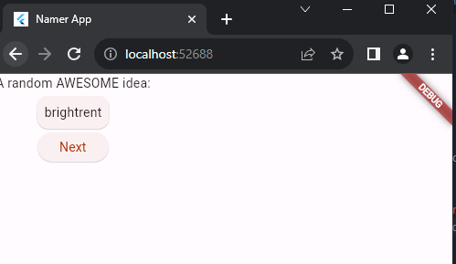
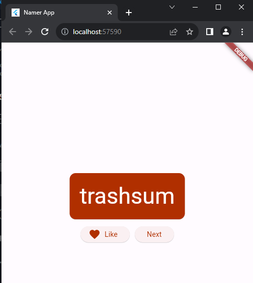
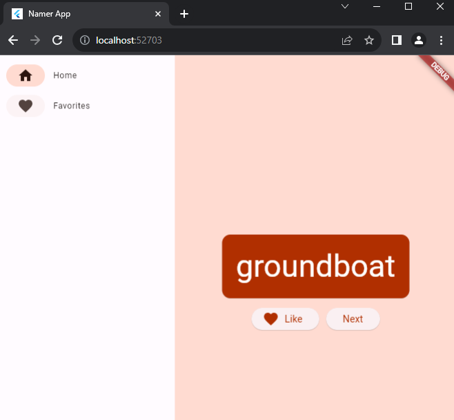
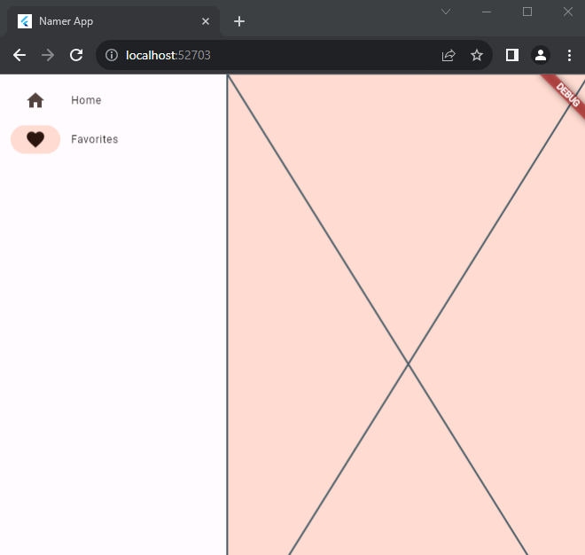
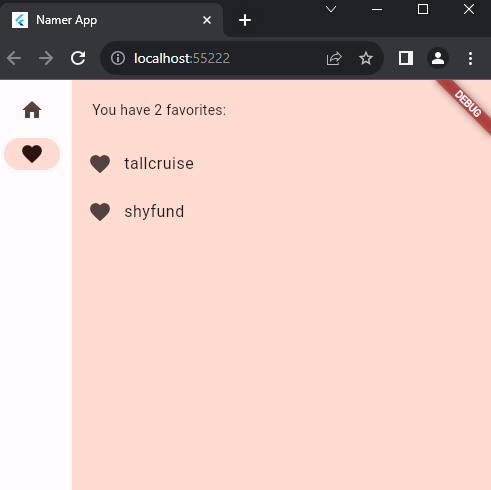

# Pemrograman Mobile Minggu 5

Nama : Sabilla Luthfi Rahmadhan

No Absen : 19

Kelas : TI-3G

---

## Praktikum 3 : Membuat proyek

Pada panel sebelah kiri VS Code, pastikan bahwa Penjelajah dipilih lalu buka file pubspec.yaml.

```
name: namer_app
description: A new Flutter project.

publish_to: 'none' # Remove this line if you wish to publish to pub.dev

version: 0.0.1+1

environment:
  sdk: '>=2.19.4 <4.0.0'

dependencies:
  flutter:
    sdk: flutter

  english_words: ^4.0.0
  provider: ^6.0.0

dev_dependencies:
  flutter_test:
    sdk: flutter

  flutter_lints: ^2.0.0

flutter:
  uses-material-design: true
```

Berikutnya, buka file konfigurasi lainnya dalam proyek tersebut, analysis_options.yaml.

```
include: package:flutter_lints/flutter.yaml

linter:
  rules:
    prefer_const_constructors: false
    prefer_final_fields: false
    use_key_in_widget_constructors: false
    prefer_const_literals_to_create_immutables: false
    prefer_const_constructors_in_immutables: false
    avoid_print: false
```

Terakhir, buka file main.dart pada direktori lib/.

```
import 'package:english_words/english_words.dart';
import 'package:flutter/material.dart';
import 'package:provider/provider.dart';

void main() {
  runApp(MyApp());
}

class MyApp extends StatelessWidget {
  const MyApp({super.key});

  @override
  Widget build(BuildContext context) {
    return ChangeNotifierProvider(
      create: (context) => MyAppState(),
      child: MaterialApp(
        title: 'Namer App',
        theme: ThemeData(
          useMaterial3: true,
          colorScheme: ColorScheme.fromSeed(seedColor: Colors.deepOrange),
        ),
        home: MyHomePage(),
      ),
    );
  }
}

class MyAppState extends ChangeNotifier {
  var current = WordPair.random();
}

class MyHomePage extends StatelessWidget {
  @override
  Widget build(BuildContext context) {
    var appState = context.watch<MyAppState>();

    return Scaffold(
      body: Column(
        children: [
          Text('A random idea:'),
          Text(appState.current.asLowerCase),
        ],
      ),
    );
  }
}
```

Output


---

## Praktikum 4 : Menambahkan Tombol

Pertama, buka lib/main.dart dan pastikan Anda memilih perangkat target. Di bagian pojok kanan bawah VS Code, Anda akan menemukan tombol yang menampilkan perangkat target saat ini. Klik tombol untuk mengubahnya.

### Hot Reload Pertama

Di bagian bawah lib/main.dart, tambahkan sesuatu pada string di objek Text pertama, dan simpan file tersebut (dengan Ctrl+S atau Cmd+S). Misalnya:

```
return Scaffold(
      body: Column(
        children: [
          Text('A random AWESOME idea:'),  // ← Example change.
          Text(appState.current.asLowerCase),
        ],
      ),
    );
```

Output :


Berikutnya, tambahkan tombol di bagian bawah Column, tepat di bawah instance Text kedua.

```
ElevatedButton(
            onPressed: () {
              print('button pressed!');
            },
            child: Text('Next'),
          ),
```

Output :


Scroll ke MyAppState lalu tambahkan metode getNext.

```
class MyAppState extends ChangeNotifier {
  var current = WordPair.random();

  // ↓ Add this.
  void getNext() {
    current = WordPair.random();
    notifyListeners();
  }
}
```

Tindakan terakhir adalah memanggil metode getNext dari callback tombol tersebut.

```
ElevatedButton(
      onPressed: () {
        appState.getNext();  // ← This instead of print().
      },
      child: Text('Next'),
    ),
```

Output :


---

## Praktikum 5 : Memperindah Tampilan Aplikasi

### Mengekstrak widget

Baris yang bertanggung jawab untuk menampilkan pasangan kata saat ini kini tampak seperti berikut: Text(appState.current.asLowerCase). Untuk mengubahnya menjadi sesuatu yang lebih kompleks, disarankan untuk mengekstrak baris ini ke widget terpisah. Memiliki beberapa widget untuk beberapa bagian logis dari UI Anda adalah cara penting dalam mengelola kompleksitas pada Flutter.

Flutter menyediakan pembantu pemfaktoran ulang untuk mengekstrak widget, tetapi sebelum Anda menggunakannya, pastikan bahwa baris yang akan diekstrak hanya mengakses yang diperlukan. Sekarang baris tersebut mengakses appState, tetapi sebenarnya baris tersebut hanya perlu mengetahui apa pasangan kata saat ini.

Oleh karena itu, tulis ulang widget MyHomePage sebagai berikut:

```
class MyHomePage extends StatelessWidget {
  @override
  Widget build(BuildContext context) {
    var appState = context.watch<MyAppState>();
    var pair = appState.current;                 // ← Add this.

    return Scaffold(
      body: Column(
        children: [
          Text('A random AWESOME idea:'),
          Text(pair.asLowerCase),                // ← Change to this.
          ElevatedButton(
            onPressed: () {
              appState.getNext();
            },
            child: Text('Next'),
          ),
        ],
      ),
    );
  }
}
```

Bagus. Widget Text tidak lagi merujuk kepada keseluruhan appState.

Sekarang, panggil menu Refactor. Pada VS Code, Klik kanan potongan kode yang ingin Anda faktorkan ulang (dalam hal ini Text) dan pilih Refactor... dari menu drop-down,

Tindakan ini secara otomatis membuat class baru, BigCard, di akhir file saat ini. Class tersebut akan terlihat seperti berikut:

```
class BigCard extends StatelessWidget {
  const BigCard({
    super.key,
    required this.pair,
  });

  final WordPair pair;

  @override
  Widget build(BuildContext context) {
    return Text(pair.asLowerCase);
  }
}
```

### Menambahkan Kartu

Sekarang saatnya membuat widget baru ini menjadi UI tebal yang kita bayangkan di awal bagian ini.

Temukan class BigCard dan metode build() yang berada di dalamnya. Sama seperti sebelumnya, panggil menu Refactor pada widget Text. Namun, kali ini Anda tidak akan mengekstrak widget.

Sebagai gantinya, pilih Wrap with Padding. Tindakan ini menciptakan widget induk baru di sekitar widget Text bernama Padding. Setelah menyimpannya, Anda akan melihat bahwa kata acak tersebut telah memiliki ruang yang lebih luas.

```
Widget build(BuildContext context) {
    return Padding(
      padding: const EdgeInsets.all(8.0),
      child: Text(pair.asLowerCase),
    );
  }
```

Berikutnya, mari kita naik satu tingkat lebih tinggi. Tempatkan kursor Anda pada widget Padding, buka menu Refactor, lalu pilih Wrap with widget....

Tindakan ini memungkinkan Anda untuk menentukan widget induk. Ketik "Card" dan tekan Enter.

```
@override
  Widget build(BuildContext context) {
    return Card(
      child: Padding(
        padding: const EdgeInsets.all(8.0),
        child: Text(pair.asLowerCase),
      ),
    );
  }
```

Output :



### Tema dan gaya

Untuk membuat kartu menjadi lebih menarik, beri warna yang lebih kaya pada kartu tersebut. Karena ada baiknya untuk menjaga skema warna yang konsisten, gunakan Theme aplikasi untuk memilih warna.

Buat perubahan berikut untuk metode build() BigCard.

```
@override
  Widget build(BuildContext context) {
    final theme = Theme.of(context);       // ← Add this.

    return Card(
      color: theme.colorScheme.primary,    // ← And also this.
      child: Padding(
        padding: const EdgeInsets.all(20),
        child: Text(pair.asLowerCase),
      ),
    );
  }
```

Output :


### TextTheme

Kartu tersebut masih memiliki masalah: ukuran teks terlalu kecil dan warnanya membuat teks sulit dibaca. Untuk memperbaiki masalah ini, buat perubahan berikut pada metode build() BigCard.

```
@override
  Widget build(BuildContext context) {
    final theme = Theme.of(context);
    // ↓ Add this.
    final style = theme.textTheme.displayMedium!.copyWith(
      color: theme.colorScheme.onPrimary,
    );

    return Card(
      color: theme.colorScheme.primary,
      child: Padding(
        padding: const EdgeInsets.all(20),
        // ↓ Change this line.
        child: Text(pair.asLowerCase, style: style),
      ),
    );
  }
```

Output :


### Meningkatkan aksesibilitas

Flutter membuat aplikasi dapat diakses secara default. Misalnya, setiap aplikasi Flutter menampilkan semua teks dan elemen interaktif di aplikasi dengan tepat untuk pembaca layar, seperti TalkBack dan VoiceOver.

```
@override
  Widget build(BuildContext context) {
    final theme = Theme.of(context);
    final style = theme.textTheme.displayMedium!.copyWith(
      color: theme.colorScheme.onPrimary,
    );

    return Card(
      color: theme.colorScheme.primary,
      child: Padding(
        padding: const EdgeInsets.all(20),

        // ↓ Make the following change.
        child: Text(
          pair.asLowerCase,
          style: style,
          semanticsLabel: "${pair.first} ${pair.second}",
        ),
      ),
    );
  }
```

Output :


### Menempatkan UI di tengah

Setelah pasangan kata acak dihadirkan dengan gaya visual yang cukup, saatnya menempatkan UI di tengah jendela/layar aplikasi.

Pertama, ingatlah bahwa BigCard adalah bagian dari Column. Secara default, kolom menggabungkan turunan kolom di bagian atas, tetapi kita dapat mengganti ini dengan mudah. Buka metode build() MyHomePage, dan buat perubahan berikut:

```
class MyHomePage extends StatelessWidget {
  @override
  Widget build(BuildContext context) {
    var appState = context.watch<MyAppState>();
    var pair = appState.current;

    return Scaffold(
      body: Column(
        mainAxisAlignment: MainAxisAlignment.center,  // ← Add this.
        children: [
          Text('A random AWESOME idea:'),
          BigCard(pair: pair),
          ElevatedButton(
            onPressed: () {
              appState.getNext();
            },
            child: Text('Next'),
          ),
        ],
      ),
    );
  }
}
```

Widget Inspector itu sendiri berada di luar cakupan codelab ini, tetapi Anda dapat melihat bahwa ketika Column ditandai, kode ini tidak menghabiskan keseluruhan lebar aplikasi. Kode ini hanya menghabiskan ruang horizontal sebanyak yang diperlukan oleh turunan UI.

Anda dapat menempatkan kolom itu sendiri di tengah. Letakkan kursor Anda di Column, buka menu Refactor (dengan Ctrl+. atau Cmd+.), lalu pilih Wrap with Center.

dan tidak merender apa pun dengan sendirinya. Widget ini biasa digunakan untuk membuat "jarak" visual.
Dengan perubahan opsional, MyHomePage mencakup kode berikut:

```
class MyHomePage extends StatelessWidget {
  @override
  Widget build(BuildContext context) {
    var appState = context.watch<MyAppState>();
    var pair = appState.current;

    return Scaffold(
      body: Center(
        child: Column(
          mainAxisAlignment: MainAxisAlignment.center,
          children: [
            BigCard(pair: pair),
            SizedBox(height: 10),
            ElevatedButton(
              onPressed: () {
                appState.getNext();
              },
              child: Text('Next'),
            ),
          ],
        ),
      ),
    );
  }
}
```

Output :


---

## Praktikum 6 : Menambahkan Fungsi

### Menambahkan logika bisnis

Scroll ke MyAppState dan tambahkan kode berikut:

```
var favorites = <WordPair>[];

  void toggleFavorite() {
    if (favorites.contains(current)) {
      favorites.remove(current);
    } else {
      favorites.add(current);
    }
    notifyListeners();
  }
```

### Menambahkan tombol

Dengan terselesaikannya "logika bisnis", saatnya untuk mengerjakan antarmuka pengguna kembali. Meletakkan tombol ‘Like' di sebelah kiri tombol ‘Next' memerlukan Row. Widget Row adalah padanan horizontal dari Column, yang telah Anda lihat sebelumnya.

Pertama, gabungkan tombol yang ada pada Row. Buka metode build() MyHomePage, letakkan kursor pada ElevatedButton, buka menu Refactor dengan Ctrl+. atau Cmd+., lalu pilih Wrap with Row.

```
Row(
  mainAxisSize: MainAxisSize.min,
              children: [
                ElevatedButton(
                  onPressed: () {
                    appState.getNext();
                  },
                  child: Text('Next'),
                ),
              ],
            ),
```

Berikut satu cara untuk menambahkan tombol kedua untuk MyHomePage. Kali ini, gunakan konstruktor ElevatedButton.icon() untuk membuat tombol dengan ikon. Di bagian atas metode build, pilih ikon yang sesuai tergantung pada apakah pasangan kata saat ini sudah berada di favorit atau tidak. Selain itu, perhatikan penggunaan SizedBox lagi, untuk menjaga jarak antara kedua tombol.

```
class MyHomePage extends StatelessWidget {
  @override
  Widget build(BuildContext context) {
    var appState = context.watch<MyAppState>();
    var pair = appState.current;

    // ↓ Add this.
    IconData icon;
    if (appState.favorites.contains(pair)) {
      icon = Icons.favorite;
    } else {
      icon = Icons.favorite_border;
    }

    return Scaffold(
      body: Center(
        child: Column(
          mainAxisAlignment: MainAxisAlignment.center,
          children: [
            BigCard(pair: pair),
            SizedBox(height: 10),
            Row(
              mainAxisSize: MainAxisSize.min,
              children: [

                // ↓ And this.
                ElevatedButton.icon(
                  onPressed: () {
                    appState.toggleFavorite();
                  },
                  icon: Icon(icon),
                  label: Text('Like'),
                ),
                SizedBox(width: 10),

                ElevatedButton(
                  onPressed: () {
                    appState.getNext();
                  },
                  child: Text('Next'),
                ),
              ],
            ),
          ],
        ),
      ),
    );
  }
}
```

Output :



---

## Praktikum 7 : Menambahkan kolom samping navigasi

Sebagian besar aplikasi tidak dapat memuat semuanya ke dalam satu layar. Aplikasi ini mungkin dapat melakukannya, tetapi untuk tujuan pembelajaran, Anda akan membuat layar terpisah untuk bagian favorit pengguna. Untuk beralih di antara dua layar, Anda akan menerapkan StatefulWidget pertama Anda.

Untuk mencapai inti dari langkah ini secepat mungkin, pisahkan MyHomePage menjadi 2 widget terpisah.

Pilih keseluruhan MyHomePage, hapus, dan gantikan dengan kode berikut:

```
class MyHomePage extends StatelessWidget {
  @override
  Widget build(BuildContext context) {
    return Scaffold(
      body: Row(
        children: [
          SafeArea(
            child: NavigationRail(
              extended: false,
              destinations: [
                NavigationRailDestination(
                  icon: Icon(Icons.home),
                  label: Text('Home'),
                ),
                NavigationRailDestination(
                  icon: Icon(Icons.favorite),
                  label: Text('Favorites'),
                ),
              ],
              selectedIndex: 0,
              onDestinationSelected: (value) {
                print('selected: $value');
              },
            ),
          ),
          Expanded(
            child: Container(
              color: Theme.of(context).colorScheme.primaryContainer,
              child: GeneratorPage(),
            ),
          ),
        ],
      ),
    );
  }
}

class GeneratorPage extends StatelessWidget {
  @override
  Widget build(BuildContext context) {
    var appState = context.watch<MyAppState>();
    var pair = appState.current;

    IconData icon;
    if (appState.favorites.contains(pair)) {
      icon = Icons.favorite;
    } else {
      icon = Icons.favorite_border;
    }

    return Center(
      child: Column(
        mainAxisAlignment: MainAxisAlignment.center,
        children: [
          BigCard(pair: pair),
          SizedBox(height: 10),
          Row(
            mainAxisSize: MainAxisSize.min,
            children: [
              ElevatedButton.icon(
                onPressed: () {
                  appState.toggleFavorite();
                },
                icon: Icon(icon),
                label: Text('Like'),
              ),
              SizedBox(width: 10),
              ElevatedButton(
                onPressed: () {
                  appState.getNext();
                },
                child: Text('Next'),
              ),
            ],
          ),
        ],
      ),
    );
  }
}
```

Output :


### Widget stateless versus stateful

Sampai sekarang, MyAppState telah memenuhi semua kebutuhan status Anda. Itulah mengapa semua widget yang telah Anda tulis sejauh ini adalah stateless. Widget-widget tersebut tidak memiliki status yang dapat diubah. Tidak ada widget yang dapat mengubah widget itu sendiri—widget tersebut harus melalui MyAppState.

Hal ini akan segera berubah.

Anda memerlukan suatu cara untuk menyimpan nilai selectedIndex kolom samping navigasi. Anda juga ingin dapat mengubah nilai ini dari dalam callback onDestinationSelected.

Anda dapat menambahkan selectedIndex sebagai properti tambahan MyAppState. Kode tersebut akan berfungsi. Namun, Anda dapat membayangkan bahwa status aplikasi akan tumbuh dengan cepat di luar kendali jika setiap widget menyimpan nilai masing-masing di dalamnya.

```
class MyAppState extends ChangeNotifier {
  var current = WordPair.random();
  var selectedIndex = 0;
  var selectedIndexInAnotherWidget = 0;
  var indexInYetAnotherWidget = 42;
  var optionASelected = false;
  var optionBSelected = false;
  var loadingFromNetwork = false;

  void getNext() {
    current = WordPair.random();
    notifyListeners();
  }

  var favorites = <WordPair>[];

  void toggleFavorite() {
    if (favorites.contains(current)) {
      favorites.remove(current);
    } else {
      favorites.add(current);
    }
    notifyListeners();
  }
}
```

Sebagian status hanya relevan untuk satu widget, sehingga status tersebut harus tetap dengan widget tersebut.

Masukkan StatefulWidget, jenis widget yang memiliki State. Pertama, konversi MyHomePage menjadi widget stateful.

Tempatkan kursor Anda di baris pertama MyHomePage (baris yang diawali dengan class MyHomePage...), lalu buka menu Refactor menggunakan Ctrl+. atau Cmd+.. Kemudian, pilih Convert to StatefulWidget.

```
class MyHomePage extends StatefulWidget {
  @override
  State<MyHomePage> createState() => _MyHomePageState();
}

class _MyHomePageState extends State<MyHomePage> {
  @override
  Widget build(BuildContext context) {
```

### setState

Widget stateful baru hanya perlu melacak satu variabel: selectedIndex. Buat 3 perubahan berikut untuk \_MyHomePageState:

```
class _MyHomePageState extends State<MyHomePage> {

  var selectedIndex = 0;     // ← Add this property.

  @override
  Widget build(BuildContext context) {
    return Scaffold(
      body: Row(
        children: [
          SafeArea(
            child: NavigationRail(
              extended: false,
              destinations: [
                NavigationRailDestination(
                  icon: Icon(Icons.home),
                  label: Text('Home'),
                ),
                NavigationRailDestination(
                  icon: Icon(Icons.favorite),
                  label: Text('Favorites'),
                ),
              ],
              selectedIndex: selectedIndex,    // ← Change to this.
              onDestinationSelected: (value) {

                // ↓ Replace print with this.
                setState(() {
                  selectedIndex = value;
                });

              },
            ),
          ),
          Expanded(
            child: Container(
              color: Theme.of(context).colorScheme.primaryContainer,
              child: GeneratorPage(),
            ),
          ),
        ],
      ),
    );
  }
}
```

Output :


### Menggunakan selectedIndex

Tempatkan kode berikut di bagian atas metode build \_MyHomePageState, tepat sebelum return Scaffold:

```
Widget page;
switch (selectedIndex) {
  case 0:
    page = GeneratorPage();
    break;
  case 1:
    page = Placeholder();
    break;
  default:
    throw UnimplementedError('no widget for $selectedIndex');
}
```

### Tingkat respons

Dalam hal ini, widget yang digunakan adalah LayoutBuilder. Widget ini memungkinkan Anda mengubah pohon widget tergantung pada seberapa banyak ruang yang tersedia yang dimiliki.

Sekali lagi, gunakan menu Refactor Flutter di VS Code untuk membuat perubahan yang diperlukan. Namun, proses kali ini sedikit lebih rumit:

Dalam metode build \_MyHomePageState, letakkan kursor Anda pada Scaffold.
Buka menu Refactor dengan Ctrl+. (Windows/Linux) atau Cmd+. (Mac).
Pilih Wrap with Builder dan tekan Enter.
Modifikasi nama Builder yang baru ditambahkan menjadi LayoutBuilder.
Modifikasi daftar parameter callback dari (context) menjadi (context, constraints).

```
return LayoutBuilder(builder: (context, constraints) {
      return Scaffold(
        body: Row(
          children: [
            SafeArea(
              child: NavigationRail(
```

Sekarang kode Anda dapat memutuskan untuk menampilkan label dengan membuat kueri constraints saat ini atau tidak. Buat perubahan baris tunggal berikut untuk metode build \_MyHomePageState:

```
class _MyHomePageState extends State<MyHomePage> {
  var selectedIndex = 0;

  @override
  Widget build(BuildContext context) {
    Widget page;
    switch (selectedIndex) {
      case 0:
        page = GeneratorPage();
        break;
      case 1:
        page = Placeholder();
        break;
      default:
        throw UnimplementedError('no widget for $selectedIndex');
    }

    return LayoutBuilder(builder: (context, constraints) {
      return Scaffold(
        body: Row(
          children: [
            SafeArea(
              child: NavigationRail(
                extended: constraints.maxWidth >= 600,  // ← Here.
                destinations: [
                  NavigationRailDestination(
                    icon: Icon(Icons.home),
                    label: Text('Home'),
                  ),
                  NavigationRailDestination(
                    icon: Icon(Icons.favorite),
                    label: Text('Favorites'),
                  ),
                ],
                selectedIndex: selectedIndex,
                onDestinationSelected: (value) {
                  setState(() {
                    selectedIndex = value;
                  });
                },
              ),
            ),
            Expanded(
              child: Container(
                color: Theme.of(context).colorScheme.primaryContainer,
                child: page,
              ),
            ),
          ],
        ),
      );
    });
  }
}
```

Output :





---

## Praktikum 8 : Menambahkan Halaman Baru

Anda ingat widget Placeholder yang kita gunakan sebagai ganti halaman Favorites?

Saatnya memperbaiki hal ini.

Jika Anda ingin mencoba hal baru, coba lakukan langkah ini sendiri. Tujuan Anda adalah menampilkan daftar favorites dalam widget stateless baru, FavoritesPage, lalu menampilkan widget tersebut, bukan Placeholder.

Berikut beberapa petunjuk untuk Anda:

Jika Anda menginginkan Column yang dapat di-scroll, gunakan widget ListView.
Ingat, akses instans MyAppState dari widget apa pun menggunakan context.watch<MyAppState>().
Jika Anda juga ingin mencoba widget baru, ListTile memiliki properti seperti title (umumnya untuk teks), leading (untuk ikon atau avatar), dan onTap (untuk interaksi). Namun, Anda dapat mencapai efek serupa dengan widget yang sudah Anda ketahui.

Dart memungkinkan penggunaan loop for dalam literal koleksi. Misalnya, jika messages berisi daftar string, Anda dapat memiliki kode seperti berikut:

```
var messages = ['Hello', 'Ahoj', "Hola'];

return Column(
  children: [
    Text('Messages:'),
    for (var msg in messages)
      Text(msg),
  ],
);
```

Di sisi lain, jika Anda lebih terbiasa dengan pemrograman fungsional, Dart juga memungkinkan Anda menulis kode seperti messages.map((m) => Text(m)).toList(). Tentu saja Anda selalu dapat membuat daftar widget dan mengisinya secara imperatif di dalam metode build.

Keuntungan menambahkan sendiri halaman Favorites adalah Anda belajar lebih banyak dengan membuat keputusan sendiri. Kekurangannya adalah Anda mungkin menemui masalah yang belum dapat Anda pecahkan sendiri. Ingat: tidak apa-apa untuk gagal, dan kegagalan adalah salah satu elemen terpenting pembelajaran. Tidak ada yang mengharapkan Anda berhasil dalam pengembangan Flutter pertama Anda, dan Anda pun seharusnya begitu.

Berikut ini hanyalah salah satu cara untuk menerapkan halaman favorit. Bagaimana halaman ini diterapkan (semoga) akan menginspirasi Anda untuk bermain dengan kode—meningkatkan UI dan membuat UI sesuai keinginan Anda.

Berikut class FavoritesPage baru:

```
class FavoritesPage extends StatelessWidget {
  @override
  Widget build(BuildContext context) {
    var appState = context.watch<MyAppState>();

    if (appState.favorites.isEmpty) {
      return Center(
        child: Text('No favorites yet.'),
      );
    }

    return ListView(
      children: [
        Padding(
          padding: const EdgeInsets.all(20),
          child: Text('You have '
              '${appState.favorites.length} favorites:'),
        ),
        for (var pair in appState.favorites)
          ListTile(
            leading: Icon(Icons.favorite),
            title: Text(pair.asLowerCase),
          ),
      ],
    );
  }
}
```

Output :


